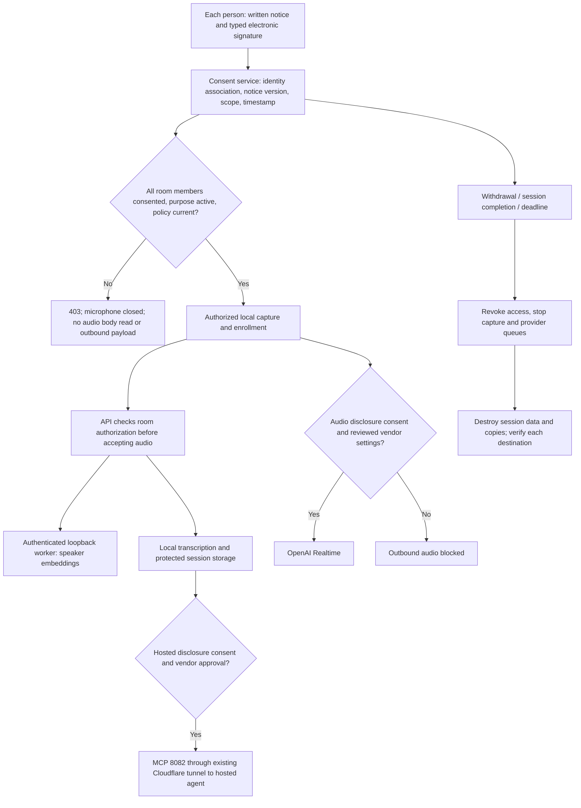

# Voiceprint v2: consent, disclosure and destruction contract

Status: implementation contract, 2026-09-06. This is an engineering control design, not a legal certification. The operator must approve the policy and vendor agreements before enabling collection. The current v3 implementation has no prior-consent gate. The pending v4 streams must implement this amendment before live testing.

## Legal basis and scope

BIPA expressly lists voiceprints; this app creates speaker-identifying ECAPA embeddings. Treat enrollment anchors, adapted profiles, segment embeddings and identity-linked derived records as protected. Plain audio is not automatically a statutory voiceprint, but apply the same controls to this pipeline's audio. Sections 10 and 15 require prior written notice/release, a public retention/destruction policy, controlled disclosure, no sale/profit from biometric data, and appropriate safeguards. Electronic signatures are recognized; a checkbox alone does not establish whose informed release it represents. Three years since last interaction is a maximum, not a default retention period. Source: [Illinois General Assembly, 740 ILCS 14](https://www.ilga.gov/Legislation/ILCS/Articles?ActID=3004&ChapterID=5).

This build uses the narrower purpose `live_conversation_v1`: identify consenting speakers and provide a speaker-attributed transcript during the current room conversation. Session completion satisfies this purpose. Saving identifiable logs for evaluation/research is a different purpose and is disabled by default. No retrospective consent is fabricated for old recordings. Withdrawal also ends the shared-microphone session and initiates destruction; do not attempt to identify and filter a nonconsenting person by processing their voice.

## 1. Data map and blocking flow

Audited main commit 82a745a and unfinished ws/api, ws/agent, ws/eval worktrees. No cloud bucket integration was found in the inspected application source; account-level storage, backups and signed vendor agreements were not inspected.

- `scripts/voiceprint_client.py`: `record_from_mic` and `Microphone` open hardware; `read_wav`/`file_chunks` ingest fixtures; `enroll` transmits PCM; `Turns` stores audio windows in memory; `Transcriber` sends audio to local faster-whisper and persists text; `Stream` sends chunks to the API and logs identities/scores.
- `scripts/realtime_openai.py`, pending `scripts/agent_runtime.py`, `scripts/providers/openai_realtime.py`: one mic is resampled to 24 kHz and sent over WebSocket to OpenAI. Audio output is queued locally. Remote MCP discloses named transcript/attribution to the provider. Existing raw provider-event logging may include session authorization and transcript content and must be replaced with an allowlisted event writer.
- `src/main/java/dev/voiceprint/SpeakerService.java`: enrollment and live chunks decode PCM before calling `SpeechEngine.Remote`; an in-memory rolling window feeds the worker. `/correct` adapts stored profiles. `/utterances` stores identity-linked text.
- `worker/worker.py`: `/analyze` extracts ECAPA vectors and uses pyannote ONNX for overlap/change; `/match` compares vectors/profiles. Local ML inference does not itself send voice to SpeechBrain/Hugging Face; setup downloads model weights. External worker URLs would create another disclosure path and must be rejected in this build.
- `Store.java`: `profiles.anchor/vector`, `segments.embedding/body`, `correction_examples`, `corrections`, `utterances`; v4 `events` and `mcp_calls` duplicate protected context. SQLite database, WAL/journal, SHM, temporary files, process memory and OS snapshots all belong in the inventory.
- `McpServer.java`, `McpHttpServer.java`, `scripts/openai_responses_probe.py`: named transcript and attribution egress, even without raw audio. Cloudflare only transports inbound hosted MCP calls on 8082 and their outbound responses; it does not transport the runtime's outbound OpenAI audio. API/UI on 8080 remain loopback-only.
- Local `data/*.jsonl`, `data/*.sqlite*`, `data/replay/*.wav`, `data/fixtures/`, `data/backups/`, terminal output and exported fixtures contain or can contain derived data. In particular the pre-v4 backup made in this session preserves profiles and must be included in the legacy inventory. Downloaded public fixtures need provenance; public availability is not a consent exemption. Do not copy real conversations into committed regression fixtures.



An API cannot stop a malicious client from sending bytes onto its socket. Admission rejects before reading/decoding an unauthorized audio body; controlled clients must obtain authorization before opening capture. The shared-mic room is a controlled environment: if a person enters or consent is uncertain, the operator stops capture before changing the roster. Speaker recognition cannot solve prior consent for bystanders.

## 2. Schema v5 and consent endpoints

Apply a numbered v4-to-v5 migration, preserving the v4 registry. Do not mark legacy rows as consented. New tables may coexist with old sessions, but old sessions are blocked from collection, processing and hosted disclosure until their handling is resolved. Do not auto-delete unknown legacy evidence during migration.

Required logical tables (SQLite INTEGER booleans constrained to 0/1):

```sql
CREATE TABLE privacy_rooms (
  session_id TEXT PRIMARY KEY,
  purpose_id TEXT NOT NULL,
  roster_version INTEGER NOT NULL DEFAULT 1,
  state TEXT NOT NULL CHECK(state IN ('pending','active','revoked','destroying','destroyed','legacy_blocked')),
  created_ms INTEGER NOT NULL,
  last_interaction_ms INTEGER NOT NULL,
  purpose_completed_ms INTEGER,
  retention_deadline_ms INTEGER NOT NULL,
  policy_version TEXT NOT NULL
);
CREATE TABLE biometric_consents (
  consent_id TEXT PRIMARY KEY,
  session_id TEXT NOT NULL REFERENCES privacy_rooms(session_id),
  participant_id TEXT NOT NULL,
  subject_name TEXT NOT NULL,
  bipa_consent_granted INTEGER NOT NULL DEFAULT 0 CHECK(bipa_consent_granted IN (0,1)),
  consent_timestamp INTEGER,
  consent_method_version TEXT,
  notice_sha256 TEXT,
  signature_text TEXT,
  identity_method TEXT,
  disclosure_scopes TEXT NOT NULL DEFAULT '[]',
  revoked_at_ms INTEGER,
  CHECK(bipa_consent_granted=0 OR
    (consent_timestamp IS NOT NULL AND consent_method_version IS NOT NULL
     AND notice_sha256 IS NOT NULL AND signature_text IS NOT NULL AND identity_method IS NOT NULL)),
  UNIQUE(session_id,participant_id)
);
```

Also persist one-use expiring consent challenges (hashed random nonce, session/participant/notice binding, expiry/consumed state), individual last-interaction/deadline records when retention crosses sessions, an append-only consent event audit, and destruction jobs/items with attempts, verified receipts and failures. A signature audit has its own documented legal-evidence retention, contains no voiceprint/audio/transcript, and does not justify keeping biometric payloads. Never put a voice recording in the signature record.

Policy configuration: `VOICEPRINT_ENTITY_NAME` must be nonempty to collect a release. Policy and method versions are fixed in code and included in the notice hash. Public `GET /privacy/notice` returns `{configured, entity_name, policy_version, consent_method_version, purpose_id, notice_text, notice_sha256, retention_text, vendors}`. It needs no API token and contains no personal data. The retention policy is also a static public document suitable for the operator's public website; the loopback GUI alone does not make the policy public to everyone.

`POST /privacy/rooms` with `{session_id, participants:[{id,name}], purpose_id:"live_conversation_v1"}` creates only a pending privacy room/roster (no audio, no embeddings), returns 201 `{session_id, state:"pending"}`. Require existing API authentication when configured, exact local Origin, validated IDs, distinct participants. Room membership is fixed for a capture epoch; changes require capture stop and fresh authorization. Existing v2 `/participants` remains agent-only.

`GET /speaker/session/{id}/consent` returns `{session_id, policy_version, consent_method_version, roster_version, allowed, participants:[{id,name,bipa_consent_granted,consent_timestamp}], scopes:{local_processing,openai_audio,hosted_mcp}, state, retention_deadline_ms}`. No signature text, nonce or full receipt is returned by this room status endpoint. `allowed` requires every human's valid current local consent, active purpose and deadline; missing/false/revoked/stale means false.

`POST /speaker/session/{id}/consents/{participant_id}/challenge` with `{}` returns `{challenge, expires_at_ms, notice_sha256}`; 15-minute, cryptographically random, single-use, bound to room/participant/current notice. `POST .../consents/{participant_id}` takes `{challenge, notice_sha256, signature_text, accepted:true, disclosure_scopes:["openai_audio","hosted_mcp"]}`. Check typed name against the roster, affirmative intent, unchanged notice, nonce and expiry, atomically consume nonce and save release. Return 201 `{consent_id,consent_timestamp,consent_method_version}`. Return 403 for failed release checks; policy missing 503. Do not accept a client-supplied granted flag or timestamps as authority.

The initial UI uses `local-kiosk-typed-name-v1`: the named person reviews and signs individually at the shared screen under operator supervision. Record identity method `in_person_self_signature`; it is NOT an authenticated online identity or cryptographic proof of who pressed the keys. Display that limitation to the operator. A remote/multi-tenant deployment requires a real authenticated subject identity and cannot reuse this kiosk trust model. The API bearer token authenticates the operator/client, never supplies a human's consent. A subject or verified legally authorized representative must sign; representative flows are not implemented in this build and collection must be refused when they are needed.

`POST /speaker/session/{id}/consents/{participant_id}/revoke` immediately marks consent false, invalidates room authorization, stops processing/egress and schedules destruction of the whole shared session. Return `{revoked:true,state:"destroying"}`; keep deletion completion distinct from revocation. `/end` now completes the collection purpose and invokes the same destruction pipeline. `/delete` must use it too. Collection is not restarted after withdrawal by toggling a checkbox or reusing a nonce.

## 3. Enforcement requirements and pseudocode

```python
def prior_consent(room, action, verified_client):
    authenticate_client(verified_client)  # a separate concept from subject consent
    with room_authorization_lock(room):
        policy = require_configured_current_policy()
        state = read_authoritative_room_and_all_human_releases(room)
        require_active_purpose_and_before_deadline(state)
        if not state.humans or any(not valid_release(p, policy) for p in state.humans):
            raise HTTP403('prior_written_release_required')
        if action in ('openai_audio', 'hosted_mcp'):
            require_every_subject_disclosure_scope(state, action)
            require_reviewed_vendor_configuration(action)
        return room_epoch_bound_permit(state)  # no raw audio or identifying vectors

permit = prior_consent(room, 'local_processing', authenticated_operator)
# Only now: open microphone, read enrollment WAV or accept an audio request body.
with capture(permit) as mic:
    for chunk in mic:
        recheck_epoch_and_consent_before_each_dispatch(permit)
        local_api.send(chunk, permit)
        if hosted_mode:
            prior_consent(room, 'openai_audio', authenticated_operator)
            provider.send(chunk)

def audio_route(request):
    prior_consent(request.header_room, 'local_processing', request.auth)
    body = bounded_read(request)  # rejects before app reads unauthorized audio
    assert body.session_and_roster == authorized_room_and_roster
    with room_operation_barrier():
        recheck_authorization()  # revoke/delete wins over queued or stale operations
        worker.analyze(body, internal_service_authorization)
        recheck_before_commit()
        persist_only_authorized_result()
```

- Java admission checks `/init` (room ID from `X-Voiceprint-Session` header before body), `/audio`, `/utterances`, `/correct`, protected reads and all hosted MCP tools. Service checks again before inference/persistence so direct invocation and retries cannot bypass the gate. Existing sessions lacking consent return 403. `/init` must match the approved human roster exactly.
- Worker `/analyze` and `/match` require a configured internal `VOICEPRINT_WORKER_TOKEN` in addition to loopback checks. Missing token fails closed. Java sends this token only to loopback worker addresses; reject arbitrary configured worker hosts. This internal token is not a consent release: only the API issues inference requests after its authoritative gate; OS permissions isolate the worker credential from microphone clients. Document that a process with the service credential remains inside the trusted boundary.
- Python capture, WAV ingestion used for processing, Transcriber, stream dispatch and realtime provider send must gate before action. The runtime waits with the mic closed while the GUI collects releases. Fetch consent status again before capture/send/inference jobs; fail closed on network errors, withdrawal, policy change or expiry. Flush queued PCM and cancel provider responses on failure. A check only at startup is insufficient.
- Preserve the existing turn-taking nudge, floor ownership, idle-ASR wait and MCP continuation behavior. No audio-based identity verification may be used to obtain prior consent. Baseline unit fixtures may be synthetic; prerecorded human fixtures require documented prior permission before replay.
- Hosted disclosure is disabled unless `VOICEPRINT_OPENAI_REVIEWED=true` AND `VOICEPRINT_CLOUDFLARE_REVIEWED=true`, plus all humans' matching disclosure scope. These flags are operator attestations that signed contracts and account settings were reviewed, not assertions the software can prove. Missing review evidence is a launch blocker. B enables no provider connection before it verifies these controls. Use `store:false` in Responses where supported; do not invent a Realtime retention parameter.
- Structured event logging must allowlist fields. Never log session configuration, authorization headers, audio, embeddings, or tool-result/transcript bodies by default. Keep the MCP terminal proof format with time/tool/caller/status/bytes, using redacted argument values where they identify people. Persist necessary proof only for the active purpose and remove it with the session. Per-response IDs, event kinds, response bytes and timing may support non-identifying tests, but linkable identifiers are not automatically anonymous.
- Existing shared logs, copied fixtures, backup DBs and unfinished worktrees require a legacy inventory and documented disposition; a later release cannot cure earlier collection. Do not silently destroy them during migration or invent missing interaction dates.

## 4. Automated destruction worker specification

Trigger immediately on session purpose completion or withdrawal; an API-owned recurring sweeper (60-second reconciliation) handles crashes and deadline expiry. Persist jobs before acknowledging the trigger, stop access immediately, and expose `destroying` until every registered destination is verified. The sweeper frequency is an operational recovery target, not a statutory grace period or a promise of instantaneous physical erasure. An orphaned active conversation expires on a short documented inactivity timeout rather than retaining data for three years.

For retained data permitted by a separately approved purpose, calculate `due = min(purpose_completed_at if present, individual_last_interaction + 3 calendar years, earlier promised deadline)`. Background polling, model replies, backups and profile recalculation are not an individual's interaction. Never extend an already-due record by accepting another heartbeat. February 29 deadlines use an explicit conservative February 28 rule when the target year has no leap day. For a shared artifact, the earliest affected person's deadline wins; do not keep a withdrawing person's voice because someone else still consents.

Worker parameters: `enabled`, `sweep_interval_seconds=60`, `batch_size=100`, `max_attempts_before_alert=3`, `job_lease_seconds=60`, explicit allowed storage roots/buckets, and dry-run inventory mode. Production must record deletion failures and retry indefinitely with alerting; it must never label a failed purge completed. Use one session-scoped lock/epoch to prevent concurrent uploads, transcription completion, floor continuation and replicas from resurrecting data.

Deletion order:

1. Commit revocation/purpose completion, advance authorization epoch, stop capture, transcription and provider dispatch; clear rolling audio and playback/ASR queues. End provider sessions and request vendor deletion where supported. Do not treat a socket close as deletion of the vendor's logs.
2. Transactionally delete enrolled profiles, correction examples, segment vectors/bodies, transcript/utterances, event feed, MCP arguments/results and other identifying session data. Keep only minimal separate consent/deletion evidence under its own approved policy. Use SQLite `secure_delete=ON`, drain connections, checkpoint/truncate WAL, and compact where required; check outcomes and retry failures. These steps do not establish erasure of old SSD blocks or OS snapshots. [SQLite secure_delete](https://www.sqlite.org/pragma.html#pragma_secure_delete).
3. For stronger deletion guarantees, encrypt biometric artifacts from first creation with per-session data keys held separately from database/backups; destroy all usable key copies and plaintext caches at expiry. A key merely scheduled for deletion or recoverable from backups has not been destroyed. No application encryption retrofit can prove historical plaintext copies never existed. Deployment must verify storage encryption, swap/crash-dump handling, access controls and media sanitization separately.
4. Delete all manifest-listed local copies/logs/exports/backups, verifying each resolved path stays within configured roots and rejecting symlink/reparse escapes. For shared files, re-encrypt only still-authorized content and destroy the original shared key/file; do not leave old copies. Restore procedures must replay revocations and deletion tombstones before exposing restored data.
5. No S3 is present now. If added, enumerate and delete every current/noncurrent version and delete marker by explicit version ID, plus replicas and incomplete multipart uploads. Verify listing emptiness; handle Object Lock/replication failures as incomplete deletion. `Expiration` alone can create a delete marker, and lifecycle processing is asynchronous, so lifecycle is a backstop rather than the immediate-purpose-completion mechanism. [AWS S3 expiration](https://docs.aws.amazon.com/AmazonS3/latest/userguide/lifecycle-expire-general-considerations.html).
6. Record only job ID, destination, attempt, counts and verified completion/failure receipts; no biometric samples or hashes of raw voices in audit evidence. Mark destroyed only after all in-scope deletion steps succeed. Escalate a valid court preservation requirement to counsel and explicitly record it; a generic internal hold must not silently override the public destruction promise.

## Vendor checklist and go-live boundaries

For OpenAI Realtime, Responses and its input transcription; Cloudflare tunnel/MCP transit; future cloud storage and subprocessors, obtain account-specific written evidence of:

- Exact data categories, purpose, endpoint/model/project, processing regions and every recipient/subprocessor. Consent to local processing does not authorize onward disclosure.
- Whether contract and actual account configuration prohibit training, model improvement, secondary use, sale/profit and human review. "Not used for training" is not "not retained."
- Zero retention eligibility AND enablement for the exact endpoints, with exceptions for abuse monitoring, legal holds, tracing, caches, files and backups; deletion APIs, timeframes and evidence.
- Executed DPA with appropriate biometric handling, limits on onward disclosure, incident notification, security, audit rights and deletion obligations. BIPA does not name a special universal "BIPA-certified DPA"; the agreement must actually support the operator's obligations. Public documentation cannot establish the account's executed terms.
- OpenAI's current documentation lists Realtime as no training, default 30-day abuse-monitoring retention, and ZDR eligible. Verify the project's approved settings rather than assuming an API key enables ZDR. Responses has additional state/storage behavior; `store:false` alone does not disable abuse-monitoring retention. [OpenAI data controls](https://developers.openai.com/api/docs/guides/your-data).
- The publicly available written retention policy, final notice/signature method, legacy-data disposition, all-room consent procedure, auth/service isolation, encrypted storage and verified destruction, and account-specific vendor approval must be resolved before describing this deployment as compliant. The tests can establish enforcement behavior, not certify legal sufficiency.

## Required verification

False/missing/revoked/stale/wrong-room consent gives 403 before body decode or inference; one unsigned human blocks the entire room; signature challenge tampering/replay and roster mismatch fail; expiry and policy changes invalidate permissions; direct worker calls without service auth fail; local consent alone cannot authorize OpenAI/MCP; API/consent outages stop capture and queued sends; purpose completion removes the full record graph; restart/sweeper retries unfinished jobs; no event log contains keys/audio/transcript; both v3-to-v4 and v4-to-v5 migrations preserve data without fabricating consent. Do not run human-audio replay or a live test before recording genuine releases.
